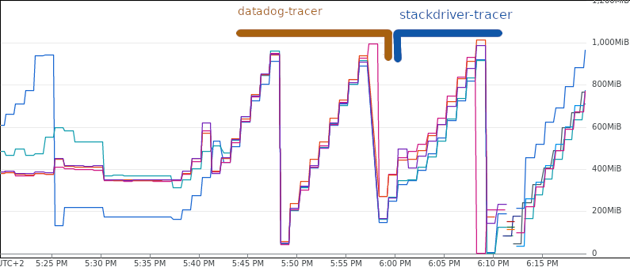

# Istio Tracing vs Memory Usage

This repository provides deployments to demonstrate memory usage of tracers (datadog) used by Istio (envoy) in environments with higher load as mentioned in github issue [#33073](https://github.com/istio/istio/issues/33073).

## Problem

When we have enabled tracing in Istio, memory usage of istio-proxies constantly grows till the container hits OOM.

In the picture bellow you can see memory constant growth in period of 10 minutes untill it hits 1GB memory limit set on istio-ingressgateway.

[](.images/memory_usage.png)

As described in the mentioned issue, we'd expect tracer to drop trace samples after flush interval or configure limit for memory buffer used in tracers. If the issue gets confirmed we'll need to patch probabbly tracer library, envoy and Istio so it's possible to configure desired limit.

## Replication

I run this test on GKE cluster v1.19.10-gke.1600 (n1-standard-4) with ~3.5k requests per seconds.

### Deploy istio

- install istio-operator

```
istioctl operator init
```

- install control plane:

```
kubectl create ns istio-system
kubectl apply -f istio/istio-operator-dd-tracer.yaml
```

### Deploy application & generate load

`kubectl -k .` will deploy 3 deployments described bellow.

**siege**

Simple [image](./siege) for [siege](https://linux.die.net/man/1/siege) tool which generates load to istio ingressgateway. The deployment has **0** replicas by default so you might to scale it up
(or modify deployment) based on demanding load.

```
kubectl -n trace-demo scale deployment siege --replicas 30
```

**statsd-logger**

[statsd-logger](https://github.com/catkins/statsd-logger) is "mock" for datadog agent because it's much easier to setup. We care only tracer library used in envoy so we need only to accept request from the tracer and return proper response.

All requests are logged to stdout so it's easy to see what data are sent to the agent.

```
kubectl -n trace-demo logs -l app=statsd-logger -f
```

I am using [fork](https://github.com/kirecek/statsd-logger/commit/c39ad33a7a46b6cab07d3430b733fcf813f48576) with simple patch that writes valid response to DD tracer to avoid any errors.

**echo-server**

Nothing fancy. Just simple echo application recieving all the traffic.


### View memory usage

#### Google metrics explorer

In case you are using GKE, you can check memory usage in [metrics explorer](https://console.cloud.google.com/monitoring/metrics-explorer)

```
https://console.cloud.google.com/monitoring/metrics-explorer?pageState={"xyChart":{"dataSets":[{"timeSeriesFilter":{"filter":"metric.type%3D\"kubernetes.io%2Fcontainer%2Fmemory%2Fused_bytes\" resource.type%3D\"k8s_container\" metadata.system_labels.\"top_level_controller_type\"%3D\"Deployment\" metadata.system_labels.\"top_level_controller_name\"%3D\"istio-ingressgateway\"","minAlignmentPeriod":"60s","aggregations":[{"perSeriesAligner":"ALIGN_MEAN","crossSeriesReducer":"REDUCE_SUM","alignmentPeriod":"60s","groupByFields":["resource.label.\"pod_name\""]},{"crossSeriesReducer":"REDUCE_NONE","alignmentPeriod":"60s"}]},"targetAxis":"Y1","plotType":"LINE","legendTemplate":"Used"}],"options":{"mode":"COLOR"},"constantLines":[],"timeshiftDuration":"0s","y1Axis":{"label":"y1Axis","scale":"LINEAR"}},"isAutoRefresh":true,"timeSelection":{"timeRange":"1h"}}
```

#### Grafana

You can deploy grafana & prometheus from [istioctl samples directory](https://github.com/istio/istio/tree/master/samples/addons):

```
kubectl apply -f samples/addons/prometheus.yaml
kubectl apply -f samples/addons/grafana.yaml
```

Port-forward grafana to localhost:

```
istioctl dashboard grafana
```

Check performance dashboard at [http://localhost:3000](http://localhost:3000).
